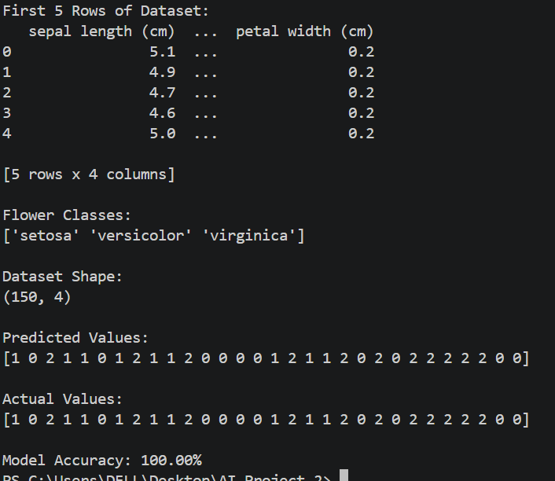

# DecodeLabs AI Internship - Project 2

## Project Title
Data Classification Using K-Nearest Neighbors (KNN)

## Project Overview

This project was developed as part of the DecodeLabs Artificial Intelligence Internship.

The project uses the K-Nearest Neighbors (KNN) algorithm to classify iris flowers based on their features using the built-in Iris dataset from Scikit-learn.

## Features

- Loads the built-in Iris dataset.
- Displays the first five rows of the dataset.
- Displays the flower classes and dataset shape.
- Splits the dataset into training and testing sets.
- Trains a K-Nearest Neighbors (KNN) classifier.
- Predicts the flower classes for the test data.
- Evaluates the model using accuracy.

## Technologies Used

- Python
- Pandas
- Scikit-learn
- Visual Studio Code

## Dataset

- Iris Dataset (Built into Scikit-learn)

## Project Structure

```
AI-Project2/
│── project2.py
│── README.md
│── requirements.txt
└── screenshots/
    └── output.png
```

## How to Run

1. Install the required libraries:

```bash
pip install pandas scikit-learn
```

2. Open the project in Visual Studio Code.

3. Run the program:

```bash
python project2.py
```

## Output

The program displays:

- First five rows of the dataset
- Flower classes
- Dataset shape
- Predicted values
- Actual values
- Model accuracy

## Output Screenshot



## Learning Outcomes

This project demonstrates:

- Data loading and handling
- Splitting data into training and testing sets
- Supervised machine learning
- K-Nearest Neighbors (KNN) classification
- Model training and prediction
- Model evaluation using accuracy

## Author

**Eman Fatima Kayani**

BSc Computer Engineering Student

DecodeLabs Artificial Intelligence Intern
